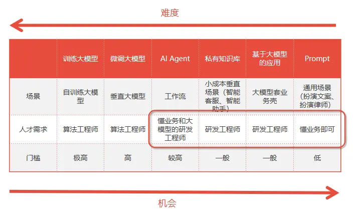

# 大模型

看一下围绕大模型的应用场景和人才需求：

Prompt工程：基于提示词对大模型的使用，会问问题就行。

基于大模型的应用：在大模型生态之上做业务层产品。AI主播、AINPC、AI小助手。。。之前是会调API就行。现在有了GPTs，连调用API都可以不用了，动动嘴就可以实现应用生成。

- **私有知识库**：给大模型配个“资料袋”——大模型外挂向量数据库/知识图谱。
- **AI Agent**：给大模型“大脑”装上记忆体、手和脚，让它可以作为智能体进行决策和工作。
- **微调大模型**：基于基座大模型的Fine Tuning。
- **训练大模型**：大模型训练，高端赛道的角逐。

因此普通程序员研究大模型，不妨选择从外到内的思路，从套壳应用，再了解部署、微调和训练。

## 前导篇

### Python

Python：AI领域最常用的编程语言。要学会基础语法、数据结构等。Python不难，对于一般程序员来说很容易上手。

### 向量数据库

随着AI的发展进入新的时代，知识的存储和表示就和向量分不开了。向量这个数学表达，在目前是人与AI交互的中间媒介。 向量数据库是一种特殊的数据库，它以多维向量的形式保存信息。让大模型拥有“记忆”，就需要用到向量数据库。

# 实战篇

## LangChain

要将大语言模型的能力开发成产品，就需要LangChain帮忙了。LangChain 是一个 LLM 编程框架，它提供了一套工具、组件和接口，借助LangChain，我们可以更加便利地给大模型这个“大脑”装上记忆和四肢，更轻松地完成基于大模型的应用开发。

比如带有私有知识库的办公助手等AI Agent，都可以借助LangChain来完成。

**LangChain主要支持6种组件**：
- Models：模型，各种类型的模型和模型集成Prompts：
- 提示，包括提示管理、提示优化和提示序列化Memory：
- 记忆，用来保存和模型交互时的上下文状态Indexes：
- 索引，用来结构化文档，以便和模型交互Chains：
- 链，一系列对各种组件的调用Agents：
- 代理，决定模型采取哪些行动，执行并且观察流程，直到完成为止

github：https://github.com/langchain-ai/langchain

官方文档：[Quickstart | ️Langchain](https://python.langchain.com/docs/get_started/quickstart.html)

## 在本地搭建部署开源模型

从零入门大模型技术，其实还是有点门槛的，硬件资源就是一关。

但还是有办法的。建议选择清华ChatGLM2-6B开源大模型进行本地部署。ChatGLM2-6B 是 ChatGLM-6B 的第二代版本，62亿的参数量的开源中英双语对话模型。

ChatGLM2-6B在保留了初代模型对话流畅、部署门槛较低等众多优秀特性的基础之上，具有更强大的性能、支持更长的上下文、更强的推理能力的特点，是Poor流选手的福音。各种尺寸的模型需要消耗的资源：

项目地址：[GitHub - THUDM/ChatGLM2-6B: ChatGLM2-6B: An Open Bilingual Chat LLM | 开源双语对话语言模型](https://github.com/THUDM/ChatGLM2-6B)

HuggingFace：https://huggingface.co/THUDM/chatglm2-6b

## 提高篇

### 机器学习基础

了解分类算法、回归算法、聚类算法、降维算法等经典的机器学习算法；模型评估：交叉验证、偏差和方差、过拟合和欠拟合、性能指标（准确率、召回率、F1分数等）。

### 深度学习基础

掌握CNN,RNN等经典网络模型，然后就是绕不开的Transformer。

Transformer是一个引入了 Self-attention 机制的模型，它是大语言模型的基石，支撑着庞大的大语言模型家族。

### NLP 基础知识

- NLP、NLU、NLG的差别；
- 自然语言处理中的基本任务和相关的应用；
- TF-IDF、word2vec、BERT等基本算法和技术；
- 预训练语言模型：模型的输入、模型的结构、训练的任务、模型的输出；
- 可以直接从word2vec开始了解，然后到transformer，bert。
- 了解LLM的3个分支和发展史根据使用的 Transformer 的方式不同，有3种常见的主流架构：encoder-only，encoder-decoder和decoder-only。

这张图清晰地展示了LLM的3个分支：

- encoder-only：BERT
- encoder-decoder：T5, GLM-130B, UL2
- decoder-only：GPT系列, LLaMA, OPT, PaLM,BLOOM

了解典型 Decoder-only 语言模型的基础结构和简单原理。

## 深入篇

- 掌握Continue Pre-train、Fine-tuning 已有开源模型的能力；
- 掌握 Lora、QLora 等最小化资源进行高效模型训练的PEFT技术；
- 掌握强化学习基础；
- Alignment与RLHF；
- 数据处理技术；
- 压缩模型、推理加速技术；
- 分布式训练并行技术；
- 分布式网络通信技术；
- 生产环境部署大模型的相关技术。
